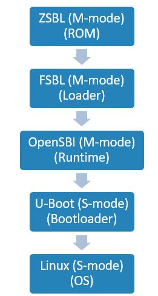
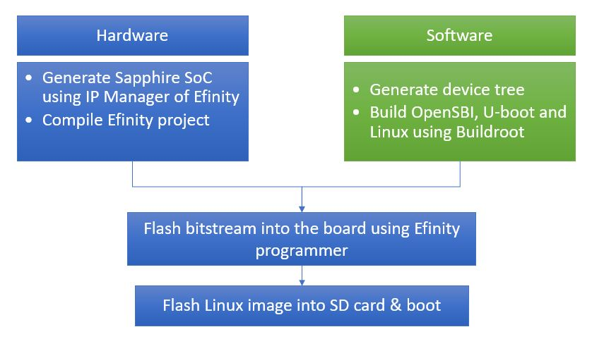

# BR2-Efinix

Welcome to BR2-Efinix.

BR2-Efinix is a custom Buildroot external tree for building Linux for Efinix Sapphire RISC-V SoC. Customized configurations to support Sapphire SoC is given, where OpenSBI, U-boot, Linux, Buildroot configuration files as well as patches are provided.

## Overview

### Buildroot

Buildroot is a simple, efficient and easy-to-use tool to generate embedded Linux systems through cross-compilation. Learn more at [Buildroot](https://buildroot.org/) official website.

### OpenSBI

OpenSBI project provide an open-source reference implementation of the RISC-V SBI specifications for platform-specific firmwares executing in M-mode. Learn more at [OpenSBI](https://github.com/riscv-software-src/opensbi) repository.

### U-Boot

U-Boot is a boot loader for Embedded boards based on RISCV, PowerPC, ARM, MIPS and several other processors, which can be installed in a boot ROM and used to
initialize and test the hardware or to download and run application code. Learn more at [U-Boot](https://github.com/u-boot/u-boot) repository.

### RISC-V Boot Sequence



image from https://riscv.org/wp-content/uploads/2019/12/Summit_bootflow.pdf

When the board power on, the first stage bootloader copy OpenSBI and U-Boot from SPI flash to external memory (RAM). Then, OpenSBI get executed to initialize the memory, stack pointer, cpus and jump to U-Boot. U-Boot load the Linux kernel and start the Linux.

### Efinix Sapphire RISC-V SoC

The Sapphire SoC is based on the VexRiscv core created by Charles Papon. The VexRiscv core is a 32-bit CPU using the ISA RISCV32I with M, A, F, D, and C extensions, has six pipeline stages (fetch, injector, decode, execute, memory, and writeback), and a configurable feature set. See [RISC-V Sapphire User Guide](https://www.efinixinc.com/docs/riscv-sapphire-ug-v3.2.pdf) from Efinix Support page for more detail on Sapphire SoC.

## Requirements

### System Dependencies

Some libraries and tools are needed to be installed for building Linux.

Tested on Ubuntu 18.04 LTS

```
sudo apt-get update && sudo apt-get upgrade -y
sudo apt-get install -y sed make binutils build-essential bash patch gzip \
bzip2 perl tar cpio unzip rsync file bc wget autoconf automake libtool \
mtools jq minicom python3-pip

pip3 install jinja2
```

### Buildroot Dependencies

This repo require specific version of Buildroot to work with. See the [VERSION](VERSION) file for the compatible Buildroot version.

### Efinix RISC-V Sapphire SoC version

- 2.2 and above

### Efinity software version version

- [Efinity](https://www.efinixinc.com/support/efinity.php) 2023.2 with patch 5 and above
- Follow the official [documentation](https://www.efinixinc.com/docs/efinity-installation-v2.6.pdf) on installation process.

### Efinity RISC-V Embedded Software IDE

- [v2023.1](https://www.efinixinc.com/support/efinity.php) and above

- Follow the official [documentation](https://www.efinixinc.com/docs/efinity-riscv-ide-2022.2.3.readme.txt) on installation process

- Learn more at the [official website](https://www.efinixinc.com/products-efinity-riscv-ide.html)

### Hardware Requirements

- Supported Efinix devkit
- 1GB micro SD card
- PMOD microSD card module*
- UART module*
- 3x male-to-female jumper cable*
- 1x MIPI and LVDS extension daughter card
- 2x USB micro cable*
- USB C cable
- External SD Card reader (if integrated SD Card Reader unavailable)
- MicroSD Adapter to adapt MicroSD to SD Card Reader (if MicroSD Card Reader unavailable)
- Ethernet cable

`Note: * only required for Trion T120F324.`

### Hardware Setup

For hardware setup please refer to [setup development board](docs/setup_development_board.md) document.

## Development Flow

The development flow divided into hardware and software. The hardware part more to generating the SoC FPGA bitstream while software more to build Linux kernel and related user space packages.



## Hardware: Generate Efinix Sapphire RISC-V SoC

Efinity software is required to generate the Sapphire RISC-V SoC. There are two ways to generate the Efinix Sapphire RISC-V SoC.

### 1. Use preconfigure Efinity project

Preconfigure Efinity project with Linux also provided in the repository for quick start. User just need to unzip the project and load the `soc.xml` project file in the Efinity software and click `Synthesize` button to generate the fpga bitstream.

- **T120F324**
  
  - [boards/efinix/t120f324/hardware/singlecore](boards/efinix/t120f324/hardware/singlecore/)
  
  - [boards/efinix/t120f324/hardware/multicores](boards/efinix/t120f324/hardware/multicores/)

- **Ti60F225**
  
  - [boards/efinix/ti60f225/hardware/singlecore](boards/efinix/ti60f225/hardware/singlecore/)
  
  - [boards/efinix/ti60f225/hardware/multicores](boards/efinix/ti60f225/hardware/multicores/)
  
  - [boards/efinix/ti60f225/hardware/ethernet](boards/efinix/ti60f225/hardware/ethernet/)

- **Ti180J484**
  
  - [boards/efinix/ti180j484/hardware/singlecore](boards/efinix/ti180j484/hardware/singlecore/)
  
  - [boards/efinix/ti180j484/hardware/multicores](boards/efinix/ti180j484/hardware/multicores/)
  
  - [boards/efinix/ti180j484/hardware/unified_hw](boards/efinix/ti180j484/hardware/unified_hw/)

- **Ti375C529**
  
  - [boards/efinix/ti375c529/hardware/soc](boards/efinix/ti375c529/hardware/soc/)
  
  - [boards/efinix/ti375c529/hardware/unified_hw](boards/efinix/ti375c529/hardware/unified_hw)

The precompiled bitstream file also provided for quick start in the `hex` format. This file stored in the Efinity project file for each supported development board. By using these files, user are not require to load and compile the Efinity project.

### 2. Generate Custom SoC

Follow these documents to generate the custom soc.

- For Sapphire High Performance SoC on Ti375C529
  
  - [generate Efinix Sapphire High Performance SoC](docs/generate_sapphirehpsoc.md)

- For Sapphire SoC on T120F324, Ti60F225 and Ti180J484
  
  - [generate Efinix Sapphire RISC-V SoC](docs/generate_sapphire_soc_for_linux.md)

## Software: Build OpenSBI, U-Boot and Linux

Please note that you need to generate the SoC first before proceed with this section. Follow these steps to build Linux image, OpenSBI and U-boot for Ti375C529 development kit using precompile bitstream of Efinity project at [boards/efinix/ti375c529/hardware/soc/soc.zip](boards/efinix/ti375c529/hardware/soc/soc.zip).

To build Linux image on other supported devices see [Build Linux Image](docs/build_linux_image.md) document.

1. Set the username and email address on gitconfig

   ```bash
   git config --global user.name "Your Name"
   git config --global user.email "your@email.com"
   ```

2. Clone this repository.
   
   ```bash
   git clone https://github.com/Efinix-Inc/br2-efinix
   cd br2-efinix
   ```

3. Run `init.sh` script to configure Linux kernel, generate device tree for Linux and U-Boot then, initialize build directory.
   
   ```bash
   source init.sh ti375c529 \
   boards/efinix/ti375c529/hardware/soc/soc.h -e
   ```

4. Build the Linux.
   
   ```bash
   make -j$(nproc)
   ```

5. The output images are located in `<path/to/br2-efinix/../build_ti375c529/build/images`.
   
   - `sdcard.img` is a Linux image
   
   - `fw_jump.bin` is an OpenSBI image
   
   - `u-boot` is an U-boot image

6. Flash firmware images.
   
   - Follow [Flash firmware image](docs/flash_firmware_image.md) document for flashing the fpga bitstream, opensbi and u-boot into the Ti375C529 devkit.

7. Flash Linux image `sdcard.img` in to SD card.
   
   - you can use [Etcher](https://www.balena.io/etcher/) for Linux
   
   - or, Linux command line to flash the Linux image into SD card. See [flash linux](docs/flash_linux.md) document.

8. Access the board serial console over USB UART. See [accessing uart terminal](docs/accessing_uart_terminal.md) document.

9. Example of Linux boot.
   
   

10. Use the login prompt as `root` at linux prompt.

11. Run the [demo](docs/demo.md) applications.

## What's Next?

1. You might want to write you own driver or custom application but do no know how to integrate it with Buildroot. See [kernel module and package](docs/kernel_module_and_packages.md) tutorial.

2. [Debugging application using GDB/GDBserver](docs/debugging/linux_application_debugging.md)

3. [Debugging Linux Kernel](docs/debugging_linux_kernel.md)

4. [Linux ethernet support](docs/ethernet_example_design.md)

## Documentation

1. [Buildroot documentation](https://buildroot.org/docs.html).  
2. [RISCV Sapphire SoC datasheet](https://www.efinixinc.com/support/docsdl.php?s=ef&pn=SAPPHIREDS)  
3. [Sapphire SoC Device Tree Generator](https://github.com/Efinix-Inc/sapphire-soc-dt-generator)
4. [Others documentation](https://github.com/Efinix-Inc/br2-efinix/tree/main/docs)

## Supported Board

Currently supported development board

1. [Trion T120F324 ](https://www.efinixinc.com/products-devkits-triont120bga324.html)
2. [Titanium Ti60F225 ](https://www.efinixinc.com/products-devkits-titaniumti60f225.html)
3. [Titanium Ti180J484](https://www.efinixinc.com/products-devkits-titaniumti180j484.html)
4. [Titanium Ti375C529](https://www.efinixinc.com/products-devkits-titaniumti375c529.html)

## License

This project is licensed under the [GPLv2](https://www.gnu.org/licenses/old-licenses/gpl-2.0.en.html) or later.

Buildroot is licensed under the [GPLv2](https://www.gnu.org/licenses/old-licenses/gpl-2.0.en.html) or later with exceptions.
