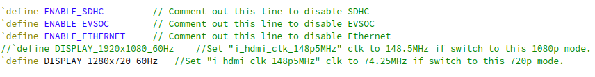
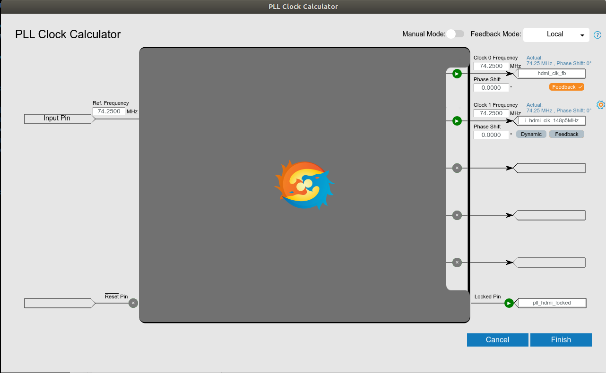

# Unified Hardware Design for High Performance Sapphire SoC

This is an example design to showcase the Efinix Sapphire High Performance SoC integrate with 

- triple speed ethernet (10/100/1000 Mbps)

- SD host controller

- MIPI camera

- HDMI display

Project repository: [EmbeddedSystem-Solution](https://github.com/Efinix-Inc/EmbeddedSystem-Solution.git)

## Modify the bootloader of unified hardware design

This section is mandatory for boot up Linux using the unified hardware design.

1. Clone the hardware design repository
   
   ```bash
   cd ~
   git clone https://github.com/Efinix-Inc/EmbeddedSystem-Solution.git
   cd EmbeddedSystem-Solution
   ```

2. Modify the bootloader using `modify_bootloader.sh` script. Please note that `modify_bootlader.sh` require 3 arguments. See [modify bootloader](docs/modify_fpga_bootloader.md) guide for more details. Here is an example to modify the bootloader.
   
   ```bash
   cd ~/br2-efinix/boards/efinix/common
   ./modify_bootloader.sh \
   ti375c529 \
   ~/EmbeddedSystem-Solution \
   ~/efinity/efinity-riscv-ide-2023.2.5.1
   ```

## Enabling X11 Graphics

X11 graphics and desktop environment are supported by enabling Linux framebuffer driver and BR2_PACKAGE_DESKTOP_ENVIRONMENT package. Please note that enabling evsoc app and drviers are not compatible with framebuffer thus they will not work.

To build the Linux image with X11 graphics, just pass the `-u -x` optional arguments to `init.sh` script.

## Additional modification for the unified hardware design

> This section is optional, but recommended for running the [evsoc_camera](../../../../../package/evsoc_camera/README.md) demo. The display resolution need to set to 720p with following these steps.
> 
> Please note that the evsoc app and drivers will not work if X11 graphics is turning on.

1. Uncomment this line `define DISPLAY_1280x720_60Hz` and comment this line `define DISPLAY_1920x1080_60Hz` from the `top_soc.v`.
   
   

2. Modify the i_hdmi_clk_148p5MHz to use 74.25MHz. Open Efinity Interface Designer -> PLL -> hdmi_pll_clk -> Automated Clock Calculation. Then, click Finish.
   
   

3. Generate the constraint by clicking Design -> Generate Efinity Constraint Files. Then, modify the `constraints.sdc` of i_hdmi_clk_148p5MHz as follows.
   
   ```
   create_clock -period 13.4680 i_hdmi_clk_148p5MHz
   ```

4. Compile the project.

## Address Mapping

See [Address Mapping for High Performance Sapphire SoC](https://github.com/Efinix-Inc/EmbeddedSystem-Solution/blob/Ti375C529/docs/soc/addr_mapping_soc.md) document.

## Board Setup

See [Setup Development Board: Titanium Ti375C529](https://github.com/Efinix-Inc/EmbeddedSystem-Solution/blob/Ti375C529/docs/hardware/setup_devkit_Ti375C529.m)

## Build Linux Image

Steps to buid the Linux image for unified hardware design.

1. Clone this repository.
   
   ```bash
   git clone https://github.com/Efinix-Inc/br2-efinix.git
   cd br2-efinix
   ```

2. Build the Linux image using preconfigure Efinity project and soc.h.
   
   i) without X11 graphics
   
   ```bash
   source init.sh ti375c529 \
   boards/efinix/ti375c529/hardware/unified_hw/soc.h \
   -u
   ```
   
   ii) with X11 graphics
   
   ```bash
   source init.sh ti375c529 \
   boards/efinix/ti375c529/hardware/unified_hw/soc.h \
   -u -x
   ```

3. Build the Linux.
   
   ```bash
   make -j$(nproc)
   ```

4. The output images are located in `<path/to/br2-efinix/../build_ti375c529/build/images`.
   
   - `sdcard.img` is a Linux image
   
   - `fw_jump.bin` is an OpenSBI image
   
   - `u-boot` is an U-boot image

5. Flash firmware images.
   
   - Follow [Flash firmware image](../../../../../docs/flash_firmware_image.md) document for flashing the fpga bitstream, opensbi and u-boot into the Ti375C529 devkit.

6. Flash Linux image `sdcard.img` in to SD card.
   
   - you can use [Etcher](https://www.balena.io/etcher/) for Linux
   
   - or, Linux command line to flash the Linux image into SD card. See [flash linux](../../../../../docs/flash_linux.md) document.

7. Access the board serial console over USB UART. See [accessing uart terminal](../../../../../docs/accessing_uart_terminal.md) document.

## Demo

See [evsoc_camera](../../../../../package/evsoc_camera/README.md) tutorial.
