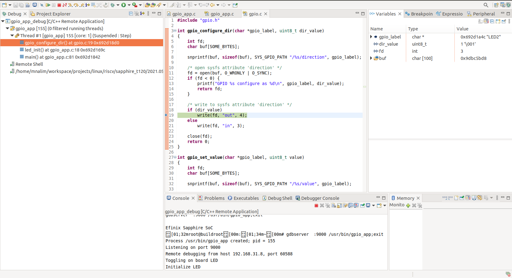

# Debugging Linux Application

In this tutorial, we are going to debug a Linux application using Efinity RISC-V Embedded Software IDE. Before start debugging, make sure you already install Efinity RISC-V Embedded Software IDE. See here [link] to install the IDE. We are going to debug  the gpio_app.

## Requirements

- Efinity RISC-V Embedded Software IDE 2023.2.1.1 or newer

- Buildroot
  
  - ssh (openssh server or dropbear)
  
  - sftp server BR2_PACKAGE_GESFTPSERVER=y
  
  - remote gdbserver

- Debuggee binary compile with debug symbol

## Create a Project

1. Launch Efinity RISC-V Embedded Software IDE.

2. Create a new project in the Efinix RISCV IDE or import existing project. 
   Select File -> New -> C/C++ Project
   
   
   
   Select “C Managed Build” then click “Next >”.
   
   
   
   At Project name, put any name for your project. Untick “use default location” then browse your existing project directory. Then, click “Next >”.

## Create Debug Configuration

1. Create a new debug configuration for your project. At the Project Explorer, right click on your project then select Debug As -> Debug Configurations…
   
   

2. In Debug Configurations window, double click on C/C++ Remote Application to create a new debug configuration.
   
   
   
   - At the Main tab, fill in the following.
     
     - Project
     
     - C/C++ Application.
       
       - Find the binary of C/C++ application in `build_<board>/build/build/<application>-<version>/`.
         
         - For example `gpio_app` binary is located in `build_ti180j484/build/build/gpio_app-1.0/gpio_app`
     
     - Build (if required) before launching.
       
       - Set to Disabled auto build as buildroot should be used to build the application.
     
     - At the bottom of the Debug Configurations window, click at the “Using GDB (DSF) Manual Remote Debugging Launcher – Select other …”. 
       A new window called “Select Preferred Launcher” will popup. Tick the Use configuration specific settings then select GDB (DSF) Automatic Remote Debugging Launcher. After that, click OK to save the configuration.
       
       
     
     - New items will be added into the Debug Configuration window such as connection.
       
       - Connection
         
         - Select Remote Host then click New …
         
         - Choose connection type: SSH
           
           
     
     - A New Connection window will popup. Fill in the following.
       
       - Host: the target board IP address
       
       - User: username of the system on the target board. For example, root
       
       - Password: password for the user or use public key based authentication.
       
       - Port: SSH port. Default is 22
         
         
     
     - At Remote Absolute File Path for C/C++ Application.
       
       - Set the absolute path of the application that will run on the target board. For example, `/root/gpio_app.` Efinix RISCV IDE will copy the application to that path and execute it.
     
     - Command to execute before the application.
       
       - Set if any. In this case, we echo a message before gpio_app gets executed.
     
     - At the Arguments tab, set the program arguments if any.
       
       
   
   - At the Debugger tab, set the following.
     Set the GDB debugger to `riscv32-linux-gdb` which has been built using buildroot. It can be found under buildroot build directory such as `build_ti180j484/build/host/bin`.
     
     

3. Click debug to start debug the application.

## Debug the Application

1. When application started, it will halt at main function. Right click at the line number and select `Toggle Breakpoint` to set the breakpoint. Then, click Run -> Resume to resume the execution of the program. It will halt at the breakpoint that already set earlier.
   
   

2. To execute line by line, select Run -> Step Into.
   
   

### Multicores Debugging

RISC-V GDB also support multicores debugging. It support all-stop mode and non-stop mode. 

#### All-stop Mode

For all-stop mode, all threads of execution stop include the current thread whenever GDB halt the thread. This allows user to examine the overall state of the program.

#### Non-stop Mode

In non-stop mode, when a thread stops by GDB, the rest of the threads still running. This allows user to examine the current state of program for the stop thread.

To enable non-stop mode, click `Run -> Debug Configuration ...`. Then, select the configuration under `C/C++ Remote Application`. Go to `Debugger` tab and select `Non-stop mode`. Then, click `Apply` and `Debug`.

