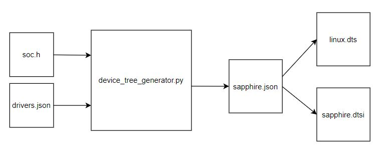

# Device Tree Generator

## Description

Script for generate device tree (*.dts, *.dtsi) from input file soc.h.

`*.dtsi` - device tree include file

- describe soc level such as number of cpu, bus, peripheral attach to bus such as spi, i2c, uart, gpio, etc

`*.dts` - device tree file

- describe board level such as RAM size, peripheral that enable on the bus

`soc.h`

- header file generated from Efinity IP Manager. Usually located in `$EFINITY_PROJECT/$embedded_sw/<project_name>/bsp/efinix/EfxSapphireSoc/include/soc.h`. It contain information of peripheral addresses and size, cpus caches.

`drivers.json` - file contain peripheral drivers name which does not provided in soc.h. Also contain hard coded information of peripherals.

## Device Tree Generation Flow



The `device_tree_generator.py` script read 2 files which are `soc .h` and `drivers.json`. The script then generate an intermediate json file called `sapphire.json`. The content of `sapphire.json` then converted to device tree format called `sapphire.dtsi` and `linux.dts`. The intermediate `sapphire.json` file gets removed after generate `*.dtsi` and `*.dts` files.

## Limitation of device tree generator script

1. Only support Efinity 2022.1 and above. Not backward compatible.

2. Assume all of the peripherals such as uart, spi, i2c, gpio are connected to single bus such as apb bus.

3. Not support multiple buses. Only single bus with multiple peripherals supported.

4. Some information such as drivers name, device tree properties specific to each peripheral are not available in soc.h. Thus, these information are hard coded in drivers.json.

## Usage

```
usage: device_tree_generator.py [-h] [-o OUTFILE] [-j] soc board

Device Tree Generator

positional arguments:
  soc                   path to soc.h
  board                 development kit name such as t120, ti60

optional arguments:
  -h, --help            show this help message and exit
  -o OUTFILE, --outfile OUTFILE
                        Override output filename. By default is sapphire.dtsi
  -j, --json            Save output file as json format
```

## Example of Run Command

```bash
export soch_path="$EFINITY_PROJECT/T120F324_devkit/embedded_sw/<project name>/bsp/efinix/EfxSapphireSoc/include/soc.h"
git clone https://github.com/Efinix-Inc/br2-efinix
cd br2-efinix/boards/efinix/common
python3 device_tree_generator.py $soch_path t120f324
```

By default, it generate device tree file called `sapphire.dtsi` and `linux.dts` in

```
br2-efinix/boards/efinix/common/dts/sapphire.dtsi
br2-efinix/boards/efinix/<board>/linux/linux.dts
```
