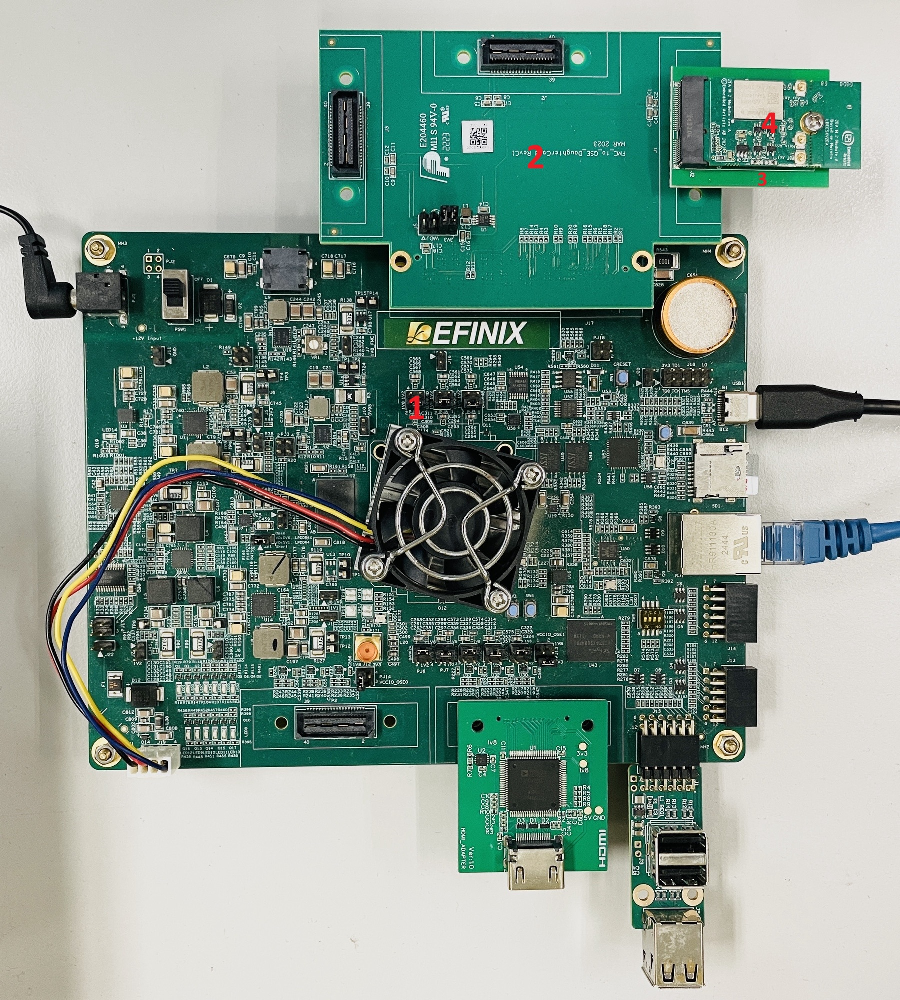
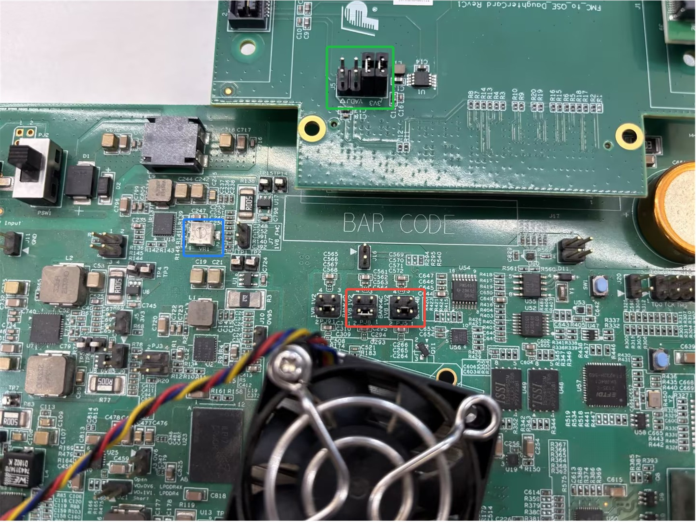

# SDIO Support

The SDIO interface has been integrated into the Unified Hardware design for the Ti375C529 devkit starting from Efinity 2025.2.  
This Unified Hardware SDIO support enables Wi-Fi solutions that communicate through the SDIO interface.
The following sections describe the hardware and software configurations required to enable the Wi-Fi solution.

## Hardware components

1. Ti375C529 devkit
2. FMC_to_QSE_RevC adapter board*
3. QSE-M2-Ext-Board*
4. Embedded Artists 2EA M.2 (EAR00413) module  

\* Refer to the [EmbeddedSystem-Solution repository](https://github.com/Efinix-Inc/EmbeddedSystem-Solution) for more detail.

<figure>
  
  <figcaption>Figure 1: Hardware</figcaption>
</figure>

---

### Hardware Settings

### Ti375C529 Development Board

- In **Figure 2** (highlighted in the **red box**), set the voltage for **BANK4B** and **BANK4C** to **1.8V**.

- Verify that the voltage of **BANK4B** and **BANK4C** reads **1.8V**.  
  If it does not, adjust **VR1** until the voltage reaches **1.8V** (as shown in the **blue box** in the figure below).

- In **Figure 2** (highlighted in the **green box**), set the voltage selection on the **FMC_to_QSE_RevC adapter board** to **3.3V**.

<figure>
  
  <figcaption>Figure 2: Ti375C529 Settings </figcaption>
</figure>

---

### Embedded Artists 2EA M.2 module

Refer to the [2EA M.2 Module Datasheet](https://www.embeddedartists.com/wp-content/uploads/2022/12/2EA_M2_Datasheet.pdf) for details and make the following modifications to the **EAR00413 module**:

- The default interface of the module is **PCIe**. For this implementation, it should be configured to use the **SDIO interface**.

- The module uses the **built-in PCB antenna** by default.  
  To achieve better performance, it is recommended to modify the PCB circuit to use an **external antenna** and connect external antennas to the **Aux Antenna** and **Main Antenna** connectors.

---

## Software components

Refer to [br2-efinix repository](https://github.com/Efinix-Inc/br2-efinix) for instructions on building the Linux, OpenSBI, and U-Boot images.
By default, Buildroot images built with the unified hardware configuration (-u option) for the Ti375C529 board include the required components to enable Wi-Fi functionality.

## Setup STA Mode

This procedure sets up a WiFi module on Linux. The process includes loading the necessary drivers, enabling the wireless interface, scanning nearby networks, connecting using `wpa_supplicant`, obtaining an IP address using DHCP, and verifying connectivity.

---

### 1. Load WiFi Drivers

After booting into Linux, navigate to one of the following directories:

```text
/lib/modules/5.10.0/extra/ifx
```

or

```text
/lib/modules/extra/ifx
```

Then run the following commands to configure the WiFi module in **STA mode**:

```bash
modprobe efx-sdio.ko
insmod compat.ko
insmod cfg80211.ko
insmod brcmutil.ko
insmod brcmfmac.ko
```

Wait until the serial console prints:

```text
inf_btsdio_init: bt over uart
```

This indicates the **WiFi driver has successfully loaded**.

---

### 2. Bring Up the WiFi Interface

Run:

```bash
ip link set wlan0 up
```

---

### 3. Scan for WiFi Networks

This command displays the names of nearby WiFi networks.
Run:

```bash
iw dev wlan0 scan | grep SSID
```

---

### 4. Configure WiFi Credentials

Use `wpa_passphrase` to automatically convert the SSID and password into a secure **PSK (Pre-Shared Key)** format.
Run:

```bash
wpa_passphrase "HomeWiFi" "mypassword123" > /etc/wpa_supplicant/wpa.conf
```

Example output:

```bash
network={
    ssid="HomeWiFi"
    #psk="mypassword123"
    psk=3f5e7c8a7c3f1a9c6d5c0f3f1c6e2b1a8d9e7c6f5b4a3c2d1e0f9a8b7c6d5e4
}
```

---

### 5. Connect to the WiFi Network

Run:

```bash
wpa_supplicant -i wlan0 -c /etc/wpa_supplicant/wpa.conf
```

---

### 6. Obtain an IP Address

Request an IP address from the router.
Run:

```bash
udhcpc -i wlan0
```

---

### 7. Check Connected WiFi Information

Run:

```bash
iw dev wlan0 info
```

---

### 8. Test Network Connectivity

Test connectivity between the device and the Internet through the connected AP.

i) Verify Internet Access

```bash
ping 8.8.8.8
ping www.google.com
```

---

ii) Download a Test File

Download a text file containing the checksum list for Ubuntu 22.04 release ISO images:

```bash
wget -O test.txt http://releases.ubuntu.com/22.04/SHA256SUMS
```

This command downloads the file and saves it locally as:

```
test.txt
```

## AP Mode

The following process configures the Linux system and Wi-Fi module to operate as a wireless Access Point (AP). First, the required Wi-Fi drivers are loaded to enable the hardware, and a `hostapd` configuration file is prepared to define network settings such as the SSID, operating band, channel, and security. The `hostapd` service is then started to broadcast the Wi-Fi network.

After the AP is running, a static IP address is assigned to the wireless interface and a DHCP server is configured to automatically provide IP addresses and network settings to connected devices. Finally, the Wi-Fi interface is checked to verify that the Access Point is operating correctly and ready for client connections.

---

### 1. Load WiFi Drivers

After booting into Linux, navigate to one of the following directories:

```text
/lib/modules/5.10.0/extra/ifx
```

or

```text
/lib/modules/extra/ifx
```

Run the following commands:

```bash
modprobe efx-sdio.ko
insmod compat.ko
insmod cfg80211.ko
insmod brcmutil.ko
insmod brcmfmac.ko
```

Wait until the serial console prints:

```text
inf_btsdio_init: bt over uart
```

This indicates the WiFi driver has successfully loaded.

---

### 2. Prepare Hostapd Configuration File

`hostapd` is the service that turns the wireless interface into a Wi-Fi Access Point.  
Edit the configuration file depending on the Wi-Fi band you want to use.

#### Example: 2.4 GHz Configuration

Save as:

```text
/root/hostapd_wifi6_2p4G.conf
```

```bash
interface=wlan0
driver=nl80211
ctrl_interface=/tmp/hostapd
ssid=test_ssid_2p4G
hw_mode=g
ieee80211n=1
ieee80211ac=1
channel=6
macaddr_acl=0
auth_algs=1
wpa=2
wpa_key_mgmt=WPA-PSK
wpa_passphrase=test_ssid
rsn_pairwise=CCMP
wpa_pairwise=CCMP
```

#### Example: 5 GHz Configuration

Save as:

```text
/root/hostapd_wifi6_5G.conf
```

```bash
interface=wlan0
driver=nl80211
ctrl_interface=/tmp/hostapd
ssid=test_ssid_5G
hw_mode=a
ieee80211n=1
ieee80211ac=1
channel=36
macaddr_acl=0
auth_algs=1
wpa=2
wpa_key_mgmt=WPA-PSK
wpa_passphrase=test_ssid
rsn_pairwise=CCMP
wpa_pairwise=CCMP
```

---

### 3. Start the Access Point

After saving the configuration, run `hostapd` to start the AP.

The `-dd` option enables debug output to verify that the AP starts correctly.

At this stage:

- The Wi-Fi SSID will appear  
- Devices cannot obtain an IP address yet  

```bash
hostapd /root/hostapd_wifi6_2p4G.conf -dd
```

or

```bash
hostapd /root/hostapd_wifi6_5G.conf -dd
```

---

### 4. Assign IP Address to the AP Interface

Open another SSH terminal and run:

```bash
ip addr add 192.168.10.1/24 dev wlan0
ip link set wlan0 up
```

---

### 5. Configure the DHCP Server

A DHCP server automatically assigns IP addresses to Wi-Fi clients.

Edit the configuration file:

```text
/etc/udhcpd.conf
```

Example configuration:

```bash
# Lease file
lease_file /var/lib/misc/udhcpd.leases

# IP range the DHCP server hands out
start 192.168.10.50
end 192.168.10.150

# Interface to run DHCP on
interface wlan0

# Gateway (router IP)
option router 192.168.10.1

# DNS servers for clients
option dns 8.8.8.8 1.1.1.1

# Subnet mask
option subnet 255.255.255.0

# Lease time in seconds
option lease 3600
```

Start the DHCP server:

```bash
udhcpd /etc/udhcpd.conf
```

Devices connecting to the AP will automatically receive:

- IP address  
- Gateway  
- DNS  

---

### 6. Verify Wi-Fi Interface Information

Run:

```bash
iw dev wlan0 info
```

This command displays:

- Interface mode  
- Channel  
- SSID  
- Tx power  
- AP status  

Example output:

```
Interface wlan0
type AP
channel 6
ssid test_ssid_2p4G
```

---

### 7. Test Network with iperf3

i) Connect a Client Device to the AP

- On a PC or laptop, connect to the WiFi network broadcast by the device.
- The DHCP server (`udhcpd`) will assign an IP address within the range:

```text
192.168.10.50 – 192.168.10.150
```

---

ii) Start the iperf3 Server on the AP Device

On the AP device run:

```bash
iperf3 -s
```

The AP device will wait for incoming performance test traffic.

---

iii) Run the iperf3 Client on the Client PC

On the client PC run:

```bash
iperf3 -c 192.168.10.1 -t 10
```

This performs a 10-second network throughput test between the client and the AP.

## Device Tree Modification

If you need to modify the device tree to support an SDIO configuration that differs from the reference design (for example, changing the SDIO controller physical address, UHS mode, or other parameters), follow the steps below.

### 1. Prerequisite

Ensure that the `init.sh` script has been executed beforehand.

### 2. Files to Modify

**Table 1: SDIO Configuration Parameters**

| File | Field | Default Value |
|-----|------|---------------|
| `boards/efinix/common/dts/sapphire.dtsi` | SDIO controller physical address | `0xe9200000` |
| | Interrupt number | `10` |
| `boards/efinix/ti375c529/linux/linux.dts` | Supported UHS modes | If no value is specified in the DTS, the driver will use **SDR25** mode by default |
| | | `sd-uhs-sdr25` |
| | | `sd-uhs-ddr50` |
| | | `sd-uhs-sdr104` |

### 3. Remove the Previous Linux Build Files

Remove the previous Linux build files if any.
Run:

```bash
make linux-dirclean
```

### 4. Rebuild the Project

Run make to rebuild the project. A new linux.dtb file will be generated in the output folder.
Run:

```bash
make
```

### 5. Run Linux with the New Configuration

There are two ways to run Linux with the new configuration.

1) Reflash the SD card using the newly generated sdcard.img in the output folder.

2) On a Windows system, insert the SD card into a card reader. You should see two files (uImage and linux.dtb) on the SD card.
Then replace the existing linux.dtb on the SD card with the newly generated linux.dtb from the output folder.
