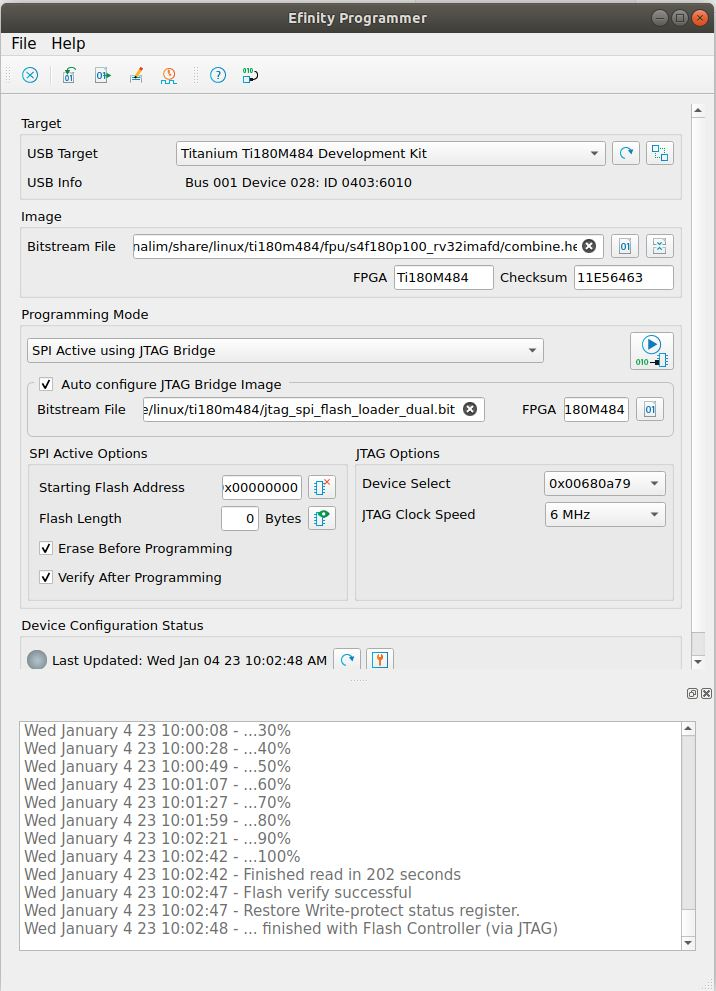

# Flash Firmware Images

The firmware files such as OpenSBI and U-boot can be flash on the supported board using Efinity programmer and USB UART cable.  You need to download the [Efinity](https://www.efinixinc.com/support/efinity.php) software from official website. 

## Prerequisite

Make sure you  have Sapphire RISC-V SoC bitstream `soc.hex`, `fw_jump.bin` and `u-boot.bin`. 

- `soc.hex` generate from Efinity software

- `fw_jump.bin` is an OpenSBI binary and `u-boot.bin` is an U-Boot binary build using `Buildroot`. See `README.md` on the root of the repository to build it.

## Firmware address

The table below shows the addresses of firmware to be flash into the SPI flash.

| Name                        | Binary name | SPI flash address |
| --------------------------- | ----------- | ----------------- |
| Sapphire SoC FPGA bitstream | soc.hex     | 0x0               |
| OpenSBI                     | fw_jump.bin | 0x00400000        |
| U-boot                      | u-boot.bin  | 0x00480000        |

## Flash Firmware

Follow these steps to flash OpenSBI and U-boot.

1. Download the Efinix Efinix and install it. Follow the official [documentation](https://www.efinixinc.com/docs/efinity-installation-v2.8.pdf) on installation process.

2. Open the Efinity program.
   
   ```bash
   cd efinity/<version>/bin
   source setup.sh 
   ./efinity
   ```

3. Click the `programmer` icon  on the Efinity to launch the `programmer`.

4. At the `Image` section on `programmer`, click **Combine Multiple Image Files**  to select FPGA bitstream (Sapphire SoC), OpenSBI and U-boot images.

5. Select `Mode` and choose **Generic Image Combination**

6. Click `Add Image` to add FPGA bitstream, OpenSBI and U-boot images. Then set the `Flash Address` for each image file. The flash address shown in the table above. Click **Apply** to save the output image.
   
   

7. Program the combine bitstream.
   
   - For Ti180M484,
     
     - On the programmer interface as section `Programming Mode`, select `SPI Active using JTAG Bridge`.
     
     - Enable `Auto configure JTAG Bridge Image` and select the `jtag_spi_flash_loader_dual.bit` for the bitstream file. This file is located in `br2-efinix/boards/efinix/ti180m484/hardware/flashloader/jtag_spi_flash_loader_dual.zip`. Unzip this file first before use.
     
     - Click the icon `Start Program` to program the board.
       
       
     
     - Press the `CRESET` button at `SW1` on the Ti180M484 once the programming finish.
- Other devkit, on the `programmer` interface at section `Programming Mode`, select `SPI Active` then click icon **Start Program**. It will takes some time to program the SPI flash.
  
  
