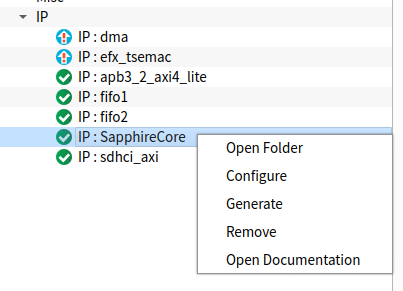
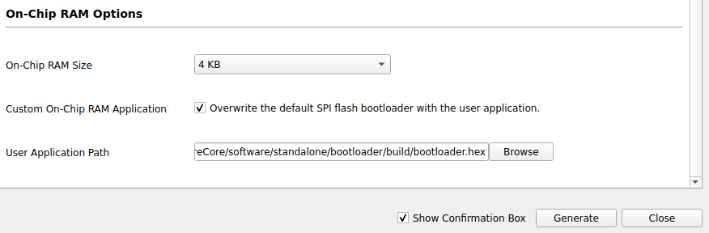
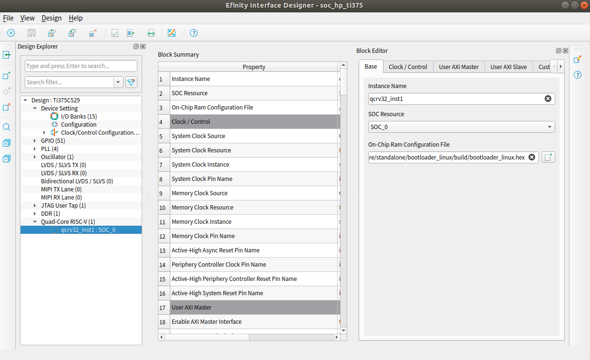

# Modify FPGA Bootloader

> You are require to modify the bootloader if generate your own custom Sapphire SoC configuration.

The bootloader is the first program get executed when the FPGA board power on. The default bootloader would not able to boot Linux kernel. 

In this tutorial, we are going to modify the bootloader program so that it can boot Linux. OpenSBI and U-Boot will be loaded first by this bootloader program before it can boot Linux. Make sure the Efinity project already created. If not exists then create a new project. See [Generate Sapphire SoC for Linux](generate_sapphire_soc_for_linux.md) guide to generate a Sapphire SoC.

The `EFINITY_PROJECT` is set as `/home/user/my_proj` targeting Ti375C529 for this tutorial.

## Prerequsite

### Install Efinity RISC-V Embedded Software IDE

Make sure to install [Efinity RISC-V Embedded Software IDE](https://www.efinixinc.com/support/ip/riscv-sdk.php) on your development machine. The RISC-V IDE provide RISC-V toolchain, debugger and Eclipse IDE. Refer to [RISC-V SoC Hardware and Software User Guide](https://www.efinixinc.com/support/docsdl.php?s=ef&pn=SAPPHIREUG) to install the IDE.

## Firmware Address

The table below shows the SPI flash address and corresponding RAM address for each firmware. The bootloader program will load these firmware to designated address during the bootstraping process.

| Firmware | SPI Flash Address | RAM Address |
| -------- | ----------------- | ----------- |
| OpenSBI  | 0x00600000        | 0x01000000  |
| U-Boot   | 0x00680000        | 0x01040000  |

## Part 1: Modified Bootloader Program

Modifying bootloader program can be challenging for beginner. There are **TWO** ways to modify and compile the bootloader program.

1. Using `modify_bootloader.sh` script. (Recommended for beginner)

2. Modify manually.

### 1a: Using modify_bootloader.sh script

The `modify_bootloader.sh` script simplify the steps for modifying bootloader program and compilation. The `modify_bootloader.sh`  script located in [modify_bootloader.sh](../boards/efinix/common/modify_bootloader.sh). The compiled bootloader is store in `EFINITY_PROJECT/linux_bootloader`.

```bash
This script used to modify and compile the first stage bootloader program for booting Linux.

usage: ./modify_bootloader.sh Devkit Project IDE [ -e][-d]
Positional arguments:
    Devkit         Supported devkits are t120f324, ti60f225, ti180j484, ti375c529
    Project        Efinity project directory. For example, /home/mnalim/soc
    IDE            RISCV IDE installation directory. For example,
                   /home/mnalim/efinity/efinity-riscv-ide-2022.2.3

Optional arguments:
    -d        Show debug message
    -e        Use example design project of Sapphire SoC.
              It will use the Efinity project from
              Project/ip/<sapphire soc>/<Devkit>_devkit/
    -h        Show this message

Example,
Modify bootloader example design of T120F324
./modify_bootloader.sh t120f324 /home/user/soc /home/user/efinity/efinity-riscv-ide-2022.2.3 -e
```

To modify the bootloader and compile using this script

```bash
./modify_bootloader.sh ti375c529 /home/user/my_proj /home/user/efinity/efinity-riscv-ide-2022.2.3 -e
```

### 1b: Modify manually

1. Copy and replace [bootloaderConfig.h](board/efinix/common/bootloaderConfig.h) to your project path.
   
   - For Ti375C529
     
     - `$EFINITY_PROJECT/ip/EfxSapphireHpSoc_slb/Ti375C529_devkit/embedded_sw/efx_hard_soc/software/standalone/bootloader/src/bootloaderConfig.h`
   
   - Other than Ti375C529
     
     - `$EFINITY_PROJECT/ip/<sapphiresoc>/Ti180J484_devkit/embedded_sw/bsp/efinix/EfxSapphireSoc/app/bootloaderConfig.h`.

2. If the target SoC is multicore, then enable SMP flag in
   
   - For Ti375C529
     
     - `$EFINITY_PROJECT/ip/EfxSapphireHpSoc_slb/Ti375C529_devkit/embedded_sw/efx_hard_soc/software/standalone/bootloader/src/makefile`
   
   - Other than Ti375C529
     
     - `$EFINITY_PROJECT/ip/<sapphiresoc>/Ti180J484_devkit/embedded_sw/bsp/efinix/EfxSapphireSoc/include/soc.mk`. Just append it in`soc.mk`.
   
   ```makefile
   CFLAGS += -DSMP
   ```

3. Launch Efinity RISC-V Embedded Software IDE from terminal to compile the bootloader program.
   
   ```bash
   cd /home/user/efinity/efinity-riscv-ide-2022.2.3
   ./efinity-riscv-ide
   ```

4. At the Efinity RISC-V IDE Launcher, click `Browse` button. Select the folder, `$EFINITY_PROJECT/ip/EfxSapphireHpSoc_slb/Ti375C529_devkit/embedded_sw/efx_hard_soc` as the workspace.
   
   > The workspace must be placed in this directory in order for the Efinity RISC-V IDE toolchain to use the correct bsp files.

5. Click on `File` -> `Import` -> `Efinix Projects`->`Efinix Makefile Project` then click `Next`.

6. Put the `BSP Location`. The location could be `$EFINITY_PROJECT/ip/EfxSapphireHpSoc_slb/Ti375C529_devkit/embedded_sw/efx_hard_soc/bsp` then click `Next`.

7. Select `bootloader` then click `Finish`.

8. Right click on the `bootloader` on the `Project Explorer` and select `Build Project`.

## Part 2: Compile Efinity Project

1. Open the existing Efinity project using Efinity software.

2. Regenerate the Sapphire SoC configuration if the project already exitst.
   
   a) For **Sapphire SoC**
   
   - Right click on the `Sapphire IP -> configure`.
     
     
   
   - On the IP configuration of Sapphire SoC, goto `Cache/Memory` tab.
     
     
     
     - Enable `Custom On-Chip RAM Application`.
     
     - Give the full path to the `bootloader.hex` at `User Application Path`.
   
   - Click `Generate` button to regenerate the SoC configuration with modified bootloader.
   
   - Compile the Efinity project.
   
   b) For **Ti375C529 with Harden RISC-V Sapphire SoC**
   
   - Open `Efinity Interface Designer`.
     
     
   
   - At `Design Explorer`, select `Quad-Core RISC-V`.
   
   - Go to `Base` tab on the `Block Editor`, then browse the `bootloader.hex` at the `On-Chip Ram Configuration File`. Click `Design -> Check Design` and click `Design -> Generate Efinity Constraint File`.
   
   - Then, click `Generate` bitstream.
     
     > Please note that you are not require to compile the whole project after modify the bootloader.
