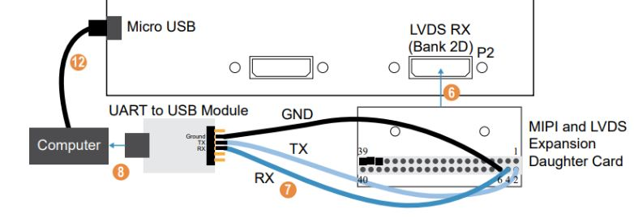

# Setup Development Board

This guide show on how to setup the development board with UART and MicroSD card module. This setup only applicable for Trion T120F324 board.

## Prerequisite

- Development kit
  
  - Trion T120 BGA324 Development kit
  
  - Titanium Ti60F225 Development kit

- MicroSD card 1GB

- PMOD MicroSD card module*

- USB UART module*

- 3x male to female jumper cable*

- MIPI and LVDS expansion daughter card*

- 2x USB micro cable*

`Note: * only required for Trion T120F324.`

## Setup T120F324

Setup the UART and PMOD MicroSD card modules for T120F324

Connect the MIPI and LVDS Expansion daughter card to the board at P2 header.

1. Connect male to female jumper wires to the daughter card and UART module:
   
   - Rx of UART module to pin 4 of daughter card 
   
   - Tx of UART module to pin 2 of daughter card
   
   - GND of UART module to pin 6 of daughter card

2. Connect the UART module to your computer via USB micro cable.

3. Connect a USB micro cable to the board and to your computer.

4. Connect PMOD MicroSD card module to J12 PMOD header on the board.

5. Jumper settings
   
   - J2, J3 set to 3.3V (pin 1 and 2)
   
   - J4 set to 2.8V (pin 9 and 10)
   
   - J5 set to 1.8 (pin 5 and 6)
   
   - J6 set to 1.2V (pin 3 and 4)

## Setup Ti60F225

The Titanium Ti60 F225 Development Board has a USB-to-UART converter connected to the Ti60's GPIOL_01 and GPIOL_02 pins.

1. Connect a USB cable type C to Ti60F225 development board and to your computer.

2. Insert micro SD card into the SD card slot.

3. Set the jumper settings as follows
   
   - J5, J6, J7 set to 3.3V (connect pin 1 and 2)
   
   - J8, J9, J10, J11 set to 1.8V (connect pin 1 and 2)

## Setup Ti180M484

1. Connect a USB cable type C to Ti180M484 development board and to your computer.

2. Insert micro SD card into the SD card slot.

3. Set the jumper settings as follows
   
   - J10, J11, J12, J13 set to 1.8V (connect pin 1 and 2, pin 3 and 4)
   
   - PT12 set to 0.6V (connect pin 1 and 2)
