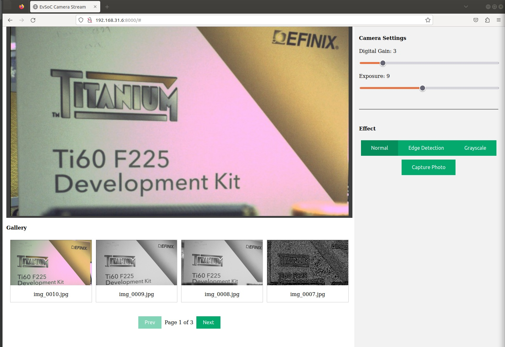

## EVSoC Camera

A simple http server which serve camera stream output over the web using mjpeg format. Use the [unified hardware](https://github.com/Efinix-Inc/Sapphire-SoC-Embedded-Solution) design to run this application.

### Supported Boards

- [Ti375C529](../../boards/efinix/ti375c529/hardware/unified_hw/README.md)

- [Ti180J484](../../boards/efinix/ti180j484/hardware/unified_hw/README.md)

### How to build?

1. Enable these configuration in the `br2-efinix/config/efinix_ti375c529_defconfig`.
   
   ```
   BR2_PACKAGE_EVSOC=y
   BR2_PACKAGE_EVSOC_CAMERA=y
   ```

2. Run `init.sh` script to enable these configuration. For example, using Ti375C529 devkit.
   
   ```
   $ source init.sh ti375c529 \
   boards/efinix/ti180j484/hardware/unified_hw/soc.h \
   -p -r -u
   ```

3. Build it
   
   ```
   $ make -j$(nproc)
   ```

### How to run?

1. Setup the network on the board. See [configure the board](../../docs/configure_the_board.md) guide.

2. Load the drivers and run the applicaton.
   
   ```
   $ modprobe i2c
   $ modprobe evsoc
   $ evsoc_camera
   ```

3. Open the web browser then go to `http://<ip address>:8000`. Replace `ip address` with the ip of the device which run this application.
   
   
